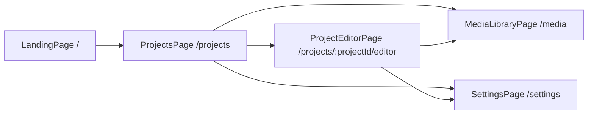
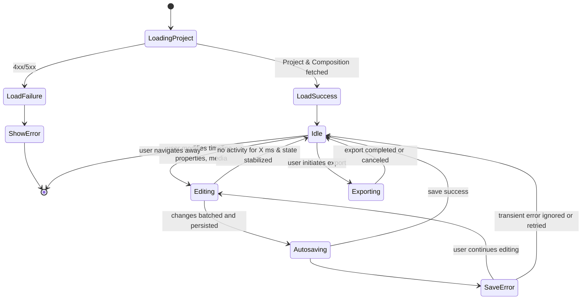
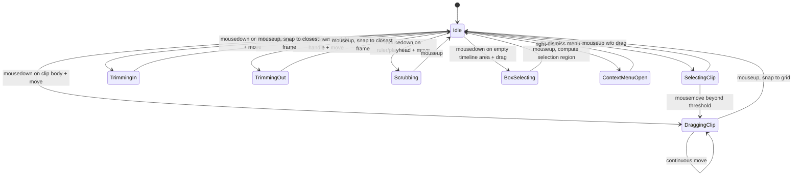
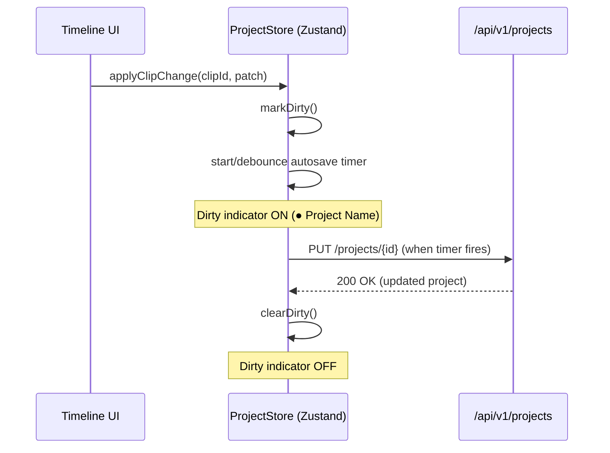
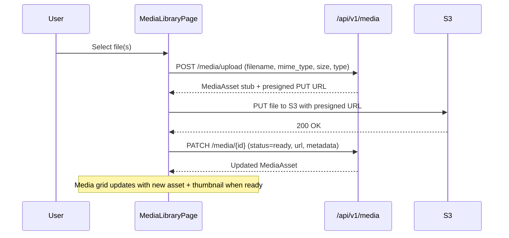
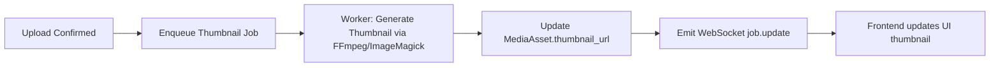
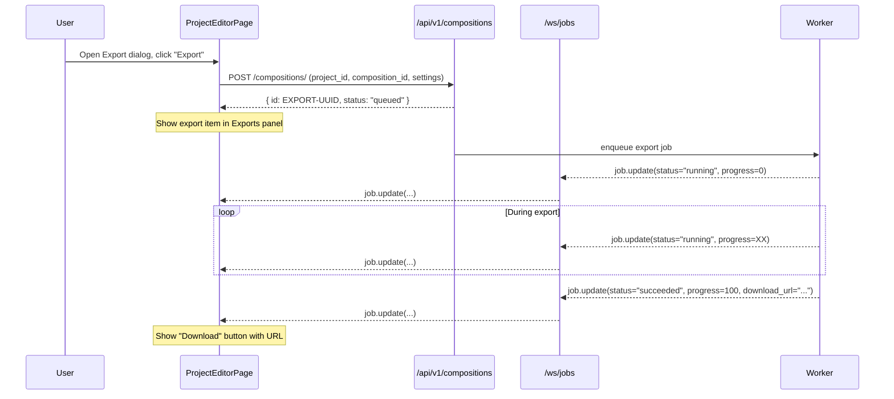
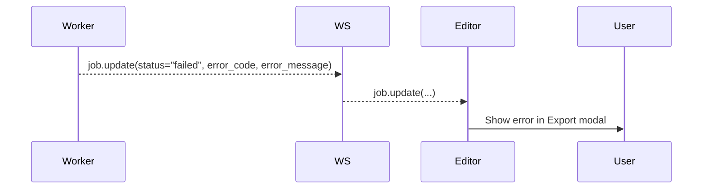
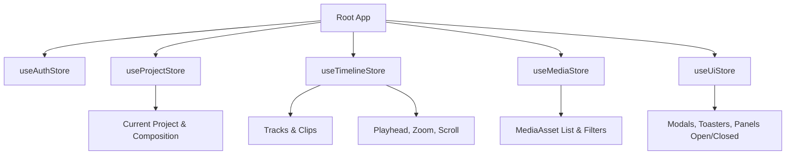

# Chronos Editor — Frontend State & Flow Diagrams
**Version**: 1.0
**Scope**: `frontend/` React + Zustand architecture
**Stack**: React 18.3+, React Router 7.x, Zustand 5.x, Vite 5.4+

This document captures the major frontend state machines and flows for Chronos Editor: project lifecycle, timeline interactions, autosave, media ingestion, and export/AI job handling.

## Technology Stack (Target Implementation)

- **Framework**: React 18.3.1 (stable) or React 19.x (with compiler support)
- **Build Tool**: Vite 5.4.21+ with @vitejs/plugin-react
- **Routing**: React Router 7.9.4 (SPA mode with data loaders)
- **State Management**: Zustand 5.0+ (vanilla stores + React Context pattern)
- **Virtualization**: react-virtuoso 4.6.2
- **Styling**: Tailwind CSS 4.0 (oxide engine)
- **UI Components**: shadcn/ui 3.5+ (Radix UI + Tailwind)

---

## 1. High-Level App Navigation Flow



---

## 2. Project Editor Lifecycle



Key notes:

- `Editing` state drives the **dirty flag** (● Project Name).  
- Autosave is debounced (e.g., 1–3 seconds after last change).  

---

## 3. Timeline Interaction State Machine



Zustand stores involved:

- `timelineStore`:
  - `selectedClipIds`
  - `hoveredClipId`
  - `playheadFrame`
  - `zoomLevel`
  - `scrollLeft`
- `editorStore`:
  - `activeTool` (e.g., select, blade)
  - `modifiers` (shift/meta state)

---

## 4. Autosave & Dirty State Flow



Error path:

```mermaid
sequenceDiagram
  Store->>API: PUT /projects/{id}
  API-->>Store: 500/422 error
  Store->>UI: showToast("Save failed")
  Note over Store: Remains dirty; retry or user continues
```

---

## 5. Media Ingestion Flow



Thumbnail generation path (backend internal):



---

## 6. Export Job Flow



Error case:



---

## 7. AI Generation Flow

```mermaid
sequenceDiagram
  participant User
  participant UI as Editor/AI Panel
  participant API as /api/v1/replicate/*
  participant WS as /ws/jobs
  participant Worker

  User->>UI: Click "Generate Clip" (prompt, aspect_ratio, quality)
  UI->>API: POST /replicate/wan-video-i2v
  API-->>UI: { job_id: "JOB-UUID" }

  API->>Worker: enqueue AI job
  Worker-->>WS: job.update(status="queued")
  WS-->>UI: job.update(...)

  loop While generating
    Worker-->>WS: job.update(status="running", progress=XX)
    WS-->>UI: job.update(...)
  end

  Worker-->>WS: job.update(
    status="succeeded",
    media_asset_id="MEDIA-UUID"
  )
  WS-->>UI: job.update(...)

  Note over UI: Fetch media asset (if needed) and append to media library
```

Failure case mirrors export failure: status `"failed"` with `error_code` & `error_message`.

---

## 8. Zustand Store Overview

At a high level, the frontend state is split into feature stores:



- `useAuthStore` — user identity, shadow user ID, tokens (if any).  
- `useProjectStore` — current project, dirty flag, autosave status.  
- `useTimelineStore` — timeline-specific interaction state.  
- `useMediaStore` — current page of media, filters, selection.  
- `useUiStore` — layout (panel sizes), active theme, etc.  

---

## 9. Notes & TBDs

- Whether to implement a dedicated `useExportStore` vs storing export jobs under `useProjectStore` remains open.
- Error handling is centralized via a `useToast` + `useErrorBoundary` composition pattern.
- Time permitting, add an explicit finite-state machine (XState or similar) for export/AI flows to reduce edge cases.

---

## 10. Implementation Patterns & Code Examples

### 10.1 React Router 7 Data Loading Pattern

```typescript
// app/routes.ts - Route configuration
import { type RouteConfig } from "@react-router/dev/routes";

export default [
  {
    path: "/",
    file: "./routes/root.tsx",
  },
  {
    path: "projects",
    file: "./routes/projects.tsx",
    children: [
      {
        index: true,
        file: "./routes/projects/index.tsx",
      },
      {
        path: ":projectId/editor",
        file: "./routes/projects/editor.tsx",
      },
    ],
  },
] satisfies RouteConfig;
```

```typescript
// routes/projects/editor.tsx - Data loader pattern
import { useLoaderData, LoaderFunctionArgs } from "react-router";
import type { Project } from "@/types";

export async function loader({ params }: LoaderFunctionArgs) {
  const projectId = params.projectId!;
  const response = await fetch(`/api/v1/projects/${projectId}`);

  if (!response.ok) {
    throw new Response("Project not found", { status: 404 });
  }

  const project: Project = await response.json();
  return { project };
}

export default function ProjectEditorPage() {
  const { project } = useLoaderData<typeof loader>();

  return (
    <div>
      <h1>{project.name}</h1>
      <Timeline project={project} />
    </div>
  );
}
```

### 10.2 Zustand 5 Store with React Context Pattern

```typescript
// stores/timelineStore.ts - Vanilla store factory
import { createStore } from 'zustand/vanilla';
import { useStore } from 'zustand';
import { createContext, useContext, useState } from 'react';
import type { ReactNode } from 'react';

export interface Clip {
  id: string;
  trackId: string;
  startFrame: number;
  endFrame: number;
  mediaAssetId: string;
}

export interface TimelineState {
  clips: Clip[];
  selectedClipIds: Set<string>;
  playheadFrame: number;
  zoomLevel: number;
  scrollLeft: number;
}

export interface TimelineActions {
  addClip: (clip: Clip) => void;
  removeClip: (clipId: string) => void;
  selectClip: (clipId: string) => void;
  setPlayhead: (frame: number) => void;
  setZoom: (level: number) => void;
}

export type TimelineStore = TimelineState & TimelineActions;

export const createTimelineStore = () => {
  return createStore<TimelineStore>()((set) => ({
    clips: [],
    selectedClipIds: new Set(),
    playheadFrame: 0,
    zoomLevel: 1.0,
    scrollLeft: 0,

    addClip: (clip) =>
      set((state) => ({
        clips: [...state.clips, clip],
      })),

    removeClip: (clipId) =>
      set((state) => ({
        clips: state.clips.filter((c) => c.id !== clipId),
        selectedClipIds: new Set(
          Array.from(state.selectedClipIds).filter((id) => id !== clipId)
        ),
      })),

    selectClip: (clipId) =>
      set((state) => {
        const newSelection = new Set(state.selectedClipIds);
        if (newSelection.has(clipId)) {
          newSelection.delete(clipId);
        } else {
          newSelection.add(clipId);
        }
        return { selectedClipIds: newSelection };
      }),

    setPlayhead: (frame) => set({ playheadFrame: frame }),

    setZoom: (level) => set({ zoomLevel: Math.max(0.25, Math.min(8.0, level)) }),
  }));
};

// Context and Provider
const TimelineStoreContext = createContext<ReturnType<typeof createTimelineStore> | null>(null);

export function TimelineStoreProvider({ children }: { children: ReactNode }) {
  const [timelineStore] = useState(createTimelineStore);

  return (
    <TimelineStoreContext.Provider value={timelineStore}>
      {children}
    </TimelineStoreContext.Provider>
  );
}

// Custom hook for consuming the store
export function useTimelineStore<U>(selector: (state: TimelineStore) => U): U {
  const store = useContext(TimelineStoreContext);

  if (!store) {
    throw new Error('useTimelineStore must be used within TimelineStoreProvider');
  }

  return useStore(store, selector);
}
```

```typescript
// Usage in components
import { useTimelineStore } from '@/stores/timelineStore';

function TimelineClipList() {
  const clips = useTimelineStore((state) => state.clips);
  const addClip = useTimelineStore((state) => state.addClip);
  const selectedIds = useTimelineStore((state) => state.selectedClipIds);

  return (
    <div>
      {clips.map((clip) => (
        <ClipItem
          key={clip.id}
          clip={clip}
          isSelected={selectedIds.has(clip.id)}
        />
      ))}
    </div>
  );
}
```

### 10.3 React Virtuoso for Timeline Virtualization

```typescript
// components/Timeline.tsx - Virtualized timeline tracks
import { Virtuoso } from 'react-virtuoso';
import { useTimelineStore } from '@/stores/timelineStore';

interface Track {
  id: string;
  label: string;
  type: 'video' | 'audio' | 'text';
}

export function Timeline({ tracks }: { tracks: Track[] }) {
  const clips = useTimelineStore((state) => state.clips);
  const zoomLevel = useTimelineStore((state) => state.zoomLevel);

  return (
    <div className="timeline-container h-full">
      <Virtuoso
        data={tracks}
        itemContent={(index, track) => (
          <TrackRow
            track={track}
            clips={clips.filter((c) => c.trackId === track.id)}
            zoomLevel={zoomLevel}
          />
        )}
        style={{ height: '100%' }}
        overscan={200}
      />
    </div>
  );
}

function TrackRow({ track, clips, zoomLevel }: {
  track: Track;
  clips: Clip[];
  zoomLevel: number;
}) {
  return (
    <div className="track-row h-16 border-b border-zinc-700 relative">
      <div className="track-label w-32 px-2 py-2">{track.label}</div>
      <div className="track-clips absolute inset-0 left-32">
        {clips.map((clip) => (
          <ClipVisual
            key={clip.id}
            clip={clip}
            zoomLevel={zoomLevel}
          />
        ))}
      </div>
    </div>
  );
}
```

### 10.4 WebSocket Integration with React

```typescript
// hooks/useJobUpdates.ts - WebSocket hook
import { useEffect, useState } from 'react';
import { useAuthStore } from '@/stores/authStore';

export interface JobUpdate {
  type: 'job.update';
  job_id: string;
  job_kind: 'image_generation' | 'video_generation' | 'export';
  status: 'queued' | 'running' | 'succeeded' | 'failed';
  progress?: number;
  download_url?: string;
  error_message?: string;
}

export function useJobUpdates(onUpdate: (update: JobUpdate) => void) {
  const userId = useAuthStore((state) => state.userId);
  const [ws, setWs] = useState<WebSocket | null>(null);

  useEffect(() => {
    if (!userId) return;

    const wsUrl = `${import.meta.env.VITE_WS_URL}/jobs?user_id=${userId}`;
    const websocket = new WebSocket(wsUrl);

    websocket.onopen = () => {
      console.log('WebSocket connected');
    };

    websocket.onmessage = (event) => {
      const update: JobUpdate = JSON.parse(event.data);
      onUpdate(update);
    };

    websocket.onerror = (error) => {
      console.error('WebSocket error:', error);
    };

    websocket.onclose = () => {
      console.log('WebSocket disconnected');
      // Implement reconnection logic
      setTimeout(() => {
        setWs(null); // Trigger reconnection
      }, 5000);
    };

    setWs(websocket);

    return () => {
      websocket.close();
    };
  }, [userId, onUpdate]);

  return ws;
}
```

### 10.5 Tailwind CSS 4 Configuration

```typescript
// tailwind.config.ts - Tailwind 4 configuration
import type { Config } from 'tailwindcss';

export default {
  content: ['./index.html', './src/**/*.{js,ts,jsx,tsx}'],
  theme: {
    extend: {
      colors: {
        // Dark mode palette
        zinc: {
          950: '#0a0a0b',
          900: '#18181b',
          800: '#27272a',
          700: '#3f3f46',
        },
        blue: {
          500: '#3b82f6',
        },
      },
      spacing: {
        // Timeline-specific spacing
        'track-height': '4rem',
        'clip-min-width': '2rem',
      },
    },
  },
  plugins: [],
} satisfies Config;
```

Alternatively, with CSS-first Tailwind 4:

```css
/* src/app.css - Tailwind 4 CSS-first configuration */
@import "tailwindcss";

@theme {
  --color-zinc-950: #0a0a0b;
  --color-zinc-900: #18181b;
  --color-zinc-800: #27272a;
  --color-zinc-700: #3f3f46;
  --color-blue-500: #3b82f6;

  --spacing-track-height: 4rem;
  --spacing-clip-min-width: 2rem;
}
```

### 10.6 Autosave Pattern with Debouncing

```typescript
// hooks/useAutosave.ts
import { useEffect, useRef } from 'react';
import { useProjectStore } from '@/stores/projectStore';

export function useAutosave(delay: number = 2000) {
  const project = useProjectStore((state) => state.project);
  const isDirty = useProjectStore((state) => state.isDirty);
  const saveProject = useProjectStore((state) => state.saveProject);
  const timeoutRef = useRef<NodeJS.Timeout | null>(null);

  useEffect(() => {
    if (!isDirty || !project) return;

    // Clear existing timeout
    if (timeoutRef.current) {
      clearTimeout(timeoutRef.current);
    }

    // Set new timeout
    timeoutRef.current = setTimeout(async () => {
      try {
        await saveProject(project.id);
        console.log('Project autosaved');
      } catch (error) {
        console.error('Autosave failed:', error);
      }
    }, delay);

    return () => {
      if (timeoutRef.current) {
        clearTimeout(timeoutRef.current);
      }
    };
  }, [project, isDirty, delay, saveProject]);
}
```

### 10.7 IndexedDB for Thumbnail Caching

```typescript
// utils/thumbnailCache.ts
import { openDB, DBSchema, IDBPDatabase } from 'idb';

interface ThumbnailDB extends DBSchema {
  thumbnails: {
    key: string; // mediaAssetId
    value: {
      id: string;
      blob: Blob;
      timestamp: number;
    };
  };
}

let dbInstance: IDBPDatabase<ThumbnailDB> | null = null;

async function getDB() {
  if (dbInstance) return dbInstance;

  dbInstance = await openDB<ThumbnailDB>('chronos-thumbnails', 1, {
    upgrade(db) {
      if (!db.objectStoreNames.contains('thumbnails')) {
        db.createObjectStore('thumbnails', { keyPath: 'id' });
      }
    },
  });

  return dbInstance;
}

export async function cacheThumbnail(id: string, blob: Blob) {
  const db = await getDB();
  await db.put('thumbnails', {
    id,
    blob,
    timestamp: Date.now(),
  });
}

export async function getThumbnail(id: string): Promise<Blob | null> {
  const db = await getDB();
  const entry = await db.get('thumbnails', id);
  return entry?.blob || null;
}

export async function clearOldThumbnails(maxAge: number = 7 * 24 * 60 * 60 * 1000) {
  const db = await getDB();
  const all = await db.getAll('thumbnails');
  const now = Date.now();

  for (const entry of all) {
    if (now - entry.timestamp > maxAge) {
      await db.delete('thumbnails', entry.id);
    }
  }
}
```